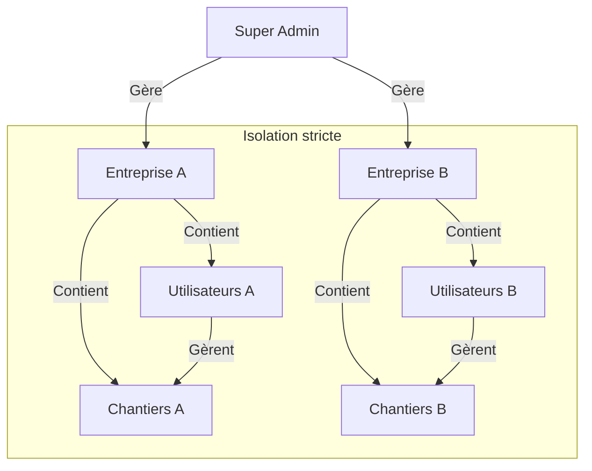

# Modèle SaaS et Multi-Tenancy

Ce document détaille l'organisation de l'application en tant que service (SaaS) et la gestion de la multi-location.

## Architecture Multi-Tenant (Base de Données Partagée)

L'application utilise une architecture **Multi-Tenant avec Base de Données Partagée**.
Toutes les entreprises clientes (Tenants) cohabitent dans la même base de données et utilisent la même instance logicielle, mais leurs données sont logiquement isolées.

### Isolation Logique
L'isolation est garantie par l'attribut `entreprise_id`.
*   **Utilisateurs** : Chaque utilisateur est lié à une seule entreprise (`users.entreprise_id`).
*   **Données** : Toutes les entités métier (`Chantier`, `Achat`, `Heure`, etc.) sont filtrées par l'entreprise de l'utilisateur connecté.
*   **Sécurité** : Le middleware et les décorateurs (`@login_required`) empêchent toute requête cross-tenant. Un Admin de l'Entreprise A ne peut techniquement pas accéder à l'ID d'un chantier de l'Entreprise B.

## Gestion Commerciale et Administrative

Le modèle repose sur une hiérarchie stricte permettant la gestion centralisée de la plateforme.

### 1. Le Super Admin (Propriétaire du SaaS)
Il possède les droits "Dieu" sur la plateforme, mais pas sur les données métier.
*   **Onboarding** : Crée les nouvelles entreprises clientes.
*   **Cycle de vie** :
    *   **Activation** : L'entreprise est créée avec `actif=True`. Ses utilisateurs peuvent se connecter.
    *   **Suspension** : En cas d'impayé ou fin de contrat, le Super Admin passe `actif=False`. L'accès est instantanément bloqué pour *tous* les utilisateurs de cette entreprise.
    *   **Suppression** : Possible mais déconseillée (archivage préférable).
*   **Configuration** : Définit les variables globales (SEO, Nom de l'app).

### 2. L'Entreprise (Client)
L'entité facturable.
*   Possède un **Administrateur Principal** (créé par le Super Admin).
*   Gère ses propres utilisateurs et chantiers de manière autonome.
*   N'a aucune visibilité sur les autres entreprises.

## Hiérarchie des Données

## Avantages du Modèle

1.  **Maintenance** : Une seule mise à jour de code impacte tous les clients.
2.  **Scalabilité** : Ajouter un client est une opération instantanée (INSERT SQL).
3.  **Coût** : Infrastructure mutualisée (un seul serveur, une seule BDD).
